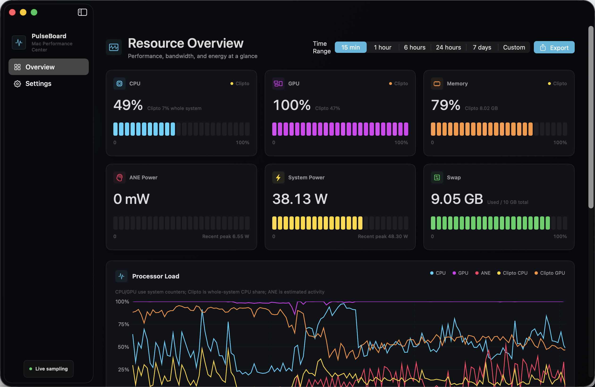

# PulseBoard

[](https://github.com/mkbird/PulseBoard/actions/workflows/ci.yml)
[](https://github.com/mkbird/PulseBoard/releases/latest)
[](https://www.apple.com/macos/)
[](LICENSE)

[简体中文](#简体中文) · [English](#english)

| 简体中文 | English |
| --- | --- |
|  |  |

## 简体中文

PulseBoard 是一个原生 SwiftUI macOS 资源监控应用。它将系统负载、带宽、功耗、历史记录和 Clipto 进程指标集中在一个界面中，并且不依赖 Homebrew、`powermetrics` 或常驻特权辅助进程。应用界面支持简体中文和英文，默认跟随 macOS，也可以在“设置 → 语言”中即时切换。

### 功能

- CPU、GPU、内存、Swap 和热状态
- 系统内存与 Clipto 内存占用对比曲线
- 网络、磁盘与 DRAM 读写带宽曲线
- ANE 活跃度、CPU/GPU/ANE 分项功耗与整机功耗
- 15 分钟至 7 天的实时窗口，以及自定义历史区间
- SQLite 本地历史记录、自动降采样图表和原始 CSV 导出
- Clipto 进程组的 CPU、GPU、内存及磁盘吞吐指标
- 菜单栏快速状态

### 下载

从 [Releases](https://github.com/mkbird/PulseBoard/releases/latest) 下载 `PulseBoard.zip`，解压后将 `PulseBoard.app` 拖入“应用程序”目录。

发布包使用 Developer ID 签名并通过 Apple 公证。最低系统版本为 macOS 14。

### 本地构建

需要 macOS 14 或更高版本，以及支持 Swift 6 的 Xcode。

```bash
git clone https://github.com/mkbird/PulseBoard.git
cd PulseBoard
swift test
swift run PulseBoard
```

生成可双击运行、使用临时签名的应用包：

```bash
./Scripts/build-app.sh
open dist/PulseBoard.app
```

重新生成图标：

```bash
./Scripts/build-icon.sh
```

图标母版位于 `Resources/AppIcon-master.png`。

### 数据来源与准确性

PulseBoard 使用 Mach、sysctl、getifaddrs、IOKit、IORegistry、IOReport 与 SMC 等本机数据源。CPU、内存、Swap、网络和磁盘指标来自系统累计计数器；速率类指标需要至少两个采样点才能形成有效增量。

ANE 活跃度、功耗、GPU 利用率和 DRAM 带宽依赖不同 Mac 及 macOS 版本上可用的硬件通道。这些指标适合观察趋势，不应用作计费、实验室校准或硬件故障判定依据。通道不可用时，界面会显示缺失值，而不会伪造数据。

Clipto 指标仅在检测到对应进程组时出现。其 CPU 百分比在部分位置会换算为整机占比，以便与系统总 CPU 曲线比较。

### 隐私与数据位置

PulseBoard 不包含遥测、分析 SDK 或云端上传逻辑。监控数据保存在本机：

- 历史数据库：`~/Library/Application Support/PulseBoard/history.sqlite`
- CSV：仅在用户主动导出时写入用户选择的位置

历史数据默认保留 120 天。可以在设置中缩短为 7、30 或 90 天；无论设置如何，超过 120 天的记录都会自动删除。

### 签名与公证

对外分发需要自己的 Developer ID Application 证书，以及保存在钥匙串中的公证凭据：

```bash
NOTARY_PROFILE=你的凭据名称 \
CODESIGN_IDENTITY="Developer ID Application: 你的名称 (TEAMID)" \
./Scripts/distribute.sh
```

成功后可分发 `dist/PulseBoard.zip`。证书私钥和公证密码不会写入仓库。

### 参与贡献

欢迎提交 Issue 和 Pull Request。开始前请阅读 [CONTRIBUTING.md](CONTRIBUTING.md)；安全问题请按 [SECURITY.md](SECURITY.md) 私下报告。

### 许可证

PulseBoard 使用 [MIT License](LICENSE)。

---

## English

PulseBoard is a native SwiftUI system monitor for macOS. It brings system load, bandwidth, power, history, and Clipto process metrics into one interface without requiring Homebrew, `powermetrics`, or a persistent privileged helper. The app supports Simplified Chinese and English, follows macOS by default, and can be switched instantly in Settings → Language.

### Features

- CPU, GPU, memory, swap, and thermal state
- System and Clipto memory usage comparison chart
- Network, disk, and DRAM read/write bandwidth charts
- ANE activity, CPU/GPU/ANE component power, and total system power
- Live windows from 15 minutes to 7 days, plus custom history ranges
- Local SQLite history, chart downsampling, and raw CSV export
- CPU, GPU, memory, and disk metrics for the Clipto process group
- Quick status in the menu bar

### Download

Download `PulseBoard.zip` from [Releases](https://github.com/mkbird/PulseBoard/releases/latest), extract it, and drag `PulseBoard.app` into Applications.

Release builds are signed with Developer ID and notarized by Apple. PulseBoard requires macOS 14 or later.

### Build from Source

You need macOS 14 or later and an Xcode version that supports Swift 6.

```bash
git clone https://github.com/mkbird/PulseBoard.git
cd PulseBoard
swift test
swift run PulseBoard
```

Create a double-clickable app bundle with an ad-hoc signature:

```bash
./Scripts/build-app.sh
open dist/PulseBoard.app
```

Regenerate the app icon:

```bash
./Scripts/build-icon.sh
```

The source artwork is stored at `Resources/AppIcon-master.png`.

### Data Sources and Accuracy

PulseBoard samples local Mach, sysctl, getifaddrs, IOKit, IORegistry, IOReport, and SMC data sources. CPU, memory, swap, network, and disk metrics are derived from system counters. Rate metrics require at least two samples before a valid delta is available.

ANE activity, power, GPU utilization, and DRAM bandwidth depend on hardware channels that vary across Mac models and macOS releases. These values are intended for trend analysis, not billing, laboratory calibration, or hardware fault diagnosis. When a channel is unavailable, PulseBoard shows a missing value instead of inventing data.

Clipto metrics appear only while a matching process group is detected. In comparison charts, Clipto CPU may be converted to its share of total system CPU capacity.

### Privacy and Data Location

PulseBoard contains no telemetry, analytics SDK, or cloud upload logic. Monitoring data remains local:

- History database: `~/Library/Application Support/PulseBoard/history.sqlite`
- CSV files: written only when the user explicitly exports to a chosen location

History is retained for 120 days by default. You can shorten retention to 7, 30, or 90 days in Settings; records older than 120 days are always deleted automatically.

### Signing and Notarization

Public distribution requires your own Developer ID Application certificate and a notarization profile stored in Keychain:

```bash
NOTARY_PROFILE=YourProfile \
CODESIGN_IDENTITY="Developer ID Application: Your Name (TEAMID)" \
./Scripts/distribute.sh
```

The resulting `dist/PulseBoard.zip` can be distributed directly. Certificate private keys and notarization passwords are never stored in the repository.

### Contributing

Issues and pull requests are welcome. Read [CONTRIBUTING.md](CONTRIBUTING.md) before contributing. Report security issues privately as described in [SECURITY.md](SECURITY.md).

### License

PulseBoard is available under the [MIT License](LICENSE).
