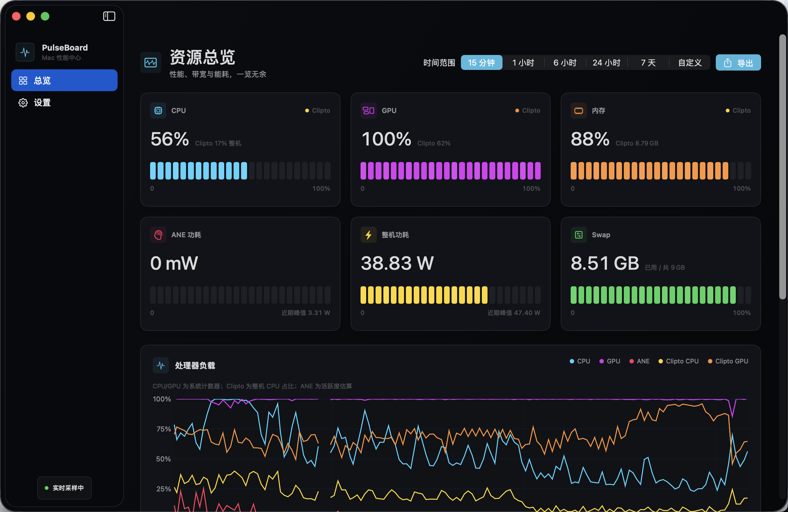

# PulseBoard

[](https://github.com/mkbird/PulseBoard/actions/workflows/ci.yml)
[](https://github.com/mkbird/PulseBoard/releases/latest)
[](https://www.apple.com/macos/)
[](LICENSE)

PulseBoard 是一个原生 SwiftUI macOS 资源监控应用。它将系统负载、带宽、功耗、历史记录和 Clipto 进程指标集中在一个界面中，并且不依赖 Homebrew、`powermetrics` 或常驻特权辅助进程。



## 功能

- CPU、GPU、内存、Swap 和热状态
- 网络、磁盘与 DRAM 读写带宽曲线
- ANE 活跃度、CPU/GPU/ANE 分项功耗与整机功耗
- 15 分钟至 7 天的实时窗口，以及自定义历史区间
- SQLite 本地历史记录、自动降采样图表和原始 CSV 导出
- Clipto 进程组的 CPU、GPU、内存及磁盘吞吐指标
- 菜单栏快速状态

## 下载

从 [Releases](https://github.com/mkbird/PulseBoard/releases/latest) 下载 `PulseBoard.zip`，解压后将 `PulseBoard.app` 拖入“应用程序”目录。

发布包使用 Developer ID 签名并通过 Apple 公证。最低系统版本为 macOS 14。

## 本地构建

需要 macOS 14 或更高版本，以及支持 Swift 6 的 Xcode。

```bash
git clone https://github.com/mkbird/PulseBoard.git
cd PulseBoard
swift test
swift run PulseBoard
```

生成可双击运行、使用临时签名的应用包：

```bash
./Scripts/build-app.sh
open dist/PulseBoard.app
```

重新生成图标：

```bash
./Scripts/build-icon.sh
```

母版位于 `Resources/AppIcon-master.png`。

## 数据来源与准确性

PulseBoard 使用 Mach、sysctl、getifaddrs、IOKit、IORegistry、IOReport 与 SMC 等本机数据源。CPU、内存、Swap、网络和磁盘指标来自系统累计计数器；速率类指标需要至少两个采样点才能形成有效增量。

ANE 活跃度、功耗、GPU 利用率和 DRAM 带宽依赖不同 Mac 及 macOS 版本上可用的硬件通道。这些指标适合观察趋势，不应用作计费、实验室校准或硬件故障判定依据。通道不可用时，界面会显示缺失值，而不会伪造数据。

Clipto 指标仅在检测到对应进程组时出现。其 CPU 百分比在部分位置会换算为整机占比，以便与系统总 CPU 曲线比较。

## 隐私与数据位置

PulseBoard 不包含遥测、分析 SDK 或云端上传逻辑。监控数据保存在本机：

- 历史数据库：`~/Library/Application Support/PulseBoard/history.sqlite`
- CSV：仅在用户主动导出时写入用户选择的位置

历史数据默认保留 30 天，可在设置中调整为 7 天或 90 天。

## 签名与公证

对外分发需要自己的 Developer ID Application 证书，以及保存在钥匙串中的公证凭据：

```bash
NOTARY_PROFILE=你的凭据名称 \
CODESIGN_IDENTITY="Developer ID Application: 你的名称 (TEAMID)" \
./Scripts/distribute.sh
```

成功后可分发 `dist/PulseBoard.zip`。证书私钥和公证密码不会写入仓库。

## 参与贡献

欢迎提交 Issue 和 Pull Request。开始前请阅读 [CONTRIBUTING.md](CONTRIBUTING.md)；安全问题请按 [SECURITY.md](SECURITY.md) 私下报告。

## 许可证

PulseBoard 使用 [MIT License](LICENSE)。
